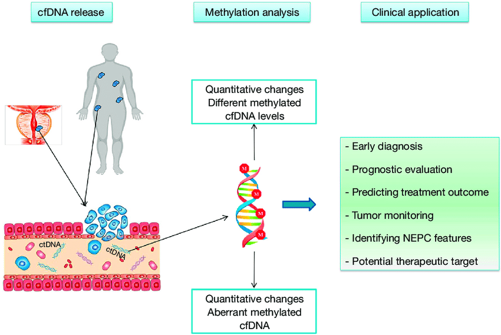
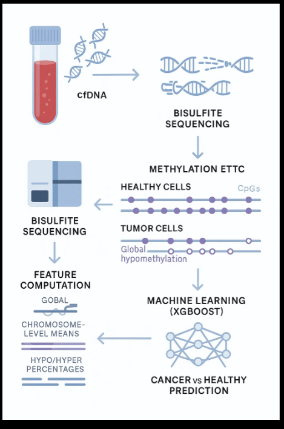

# Multi-Cancer Early Detection (MCED) using cfDNA Methylation  
A Machine Learning Pipeline for Early-Stage Tumor Detection from Blood

This repository contains my research project where I build a complete end-to-end workflow for detecting cancer from **cell-free DNA (cfDNA)** methylation patterns. It includes data preprocessing, feature extraction, model training, evaluation, and a prediction pipeline that works on new patient samples.  
This project is still in progress, and I am improving the dataset size and accuracy over time.
<p align="center">     </p>

## Background

DNA methylation is one of the strongest biomarkers for cancer. Tumor cells release fragmented DNA into the bloodstream (cfDNA), and their methylation pattern becomes different compared to healthy cells.Detecting such modifications early can provide inexpensive cancer screening, even before symptoms or imaging results.  However, cfDNA signals are loud, sparse, and extremely changeable, making reliable early detection problematic.By analyzing genome-wide methylation from cfDNA, it is possible to detect cancer early — even before imaging.

<p align="center">
  
</p>

<p align="center"><em>Figure 1: Overview of circulating cell-free DNA methylation and its potential clinical application[1]</em></p>

Tumors typically exhibit global hypomethylation and focal promoter hypermethylation, both of which can be captured through cfDNA sequencing. Several major studies, including the GRAIL/CCGA investigations, demonstrate that targeted methylation patterns in cfDNA can identify more than 50 cancer types with high specificity and can also predict the tissue of origin. However, multiple researchers highlight technical challenges such as coverage heterogeneity, fragment-size bias, and dataset batch effects, making cfDNA methylation a powerful but complex domain.

DNA methylation has been repeatedly validated as one of the most reliable and stable biomarkers for detecting cancer. Tumors undergo widespread epigenetic disruption, including decreased methylation across large genomic regions and increased methylation at promoter sites, and these aberrant signatures remain detectable even after DNA fragments enter the bloodstream (Vincenza et al., 2021). Because of this stability, cfDNA methylation enables non-invasive early detection, often before imaging or clinical symptoms appear.[1,2]

Recent systematic reviews on population-scale screening (Ros et al., 2024) support the idea that cfDNA methylation can reveal dozens of cancer types with excellent specificity. Furthermore, advanced machine-learning approaches—such as those described by Janet et al. (2024)—have shown that integrating sparse genome-wide CpG signals enables accurate detection of early-stage cancers across multiple tissues. Policy-oriented studies (Mussab et al., 2024) also suggest that MCED tests can complement existing screening workflows and significantly improve early diagnostic pathways.[3,4]

Technological progress in cfDNA sequencing has accelerated the field even further. THUNDER (Gao et al., 2023) demonstrated that low-input cfDNA methylation sequencing can robustly distinguish tumor-derived fragments from healthy DNA. TOTEM (Xiong et al., 2024) introduced a powerful approach capable of predicting the tissue of origin using methylation markers, even when coverage is extremely sparse. Real-world evidence from over 100,000 clinical tests (Matrana et al., 2025) shows that cfDNA methylation-based MCED assays can be deployed safely and reproducibly across diverse populations, offering consistent diagnostic utility.[5,6,7]

These research findings show that genome-wide cfDNA methylation—when combined with well-engineered computational pipelines—forms a promising yet technically demanding foundation for multi-cancer early detection. This scientific landscape directly motivates the design and development of the MCED model implemented in this project.
The findings indicate that, when paired with reliable computational pipelines, genome-wide cfDNA methylation offers a promising but technically challenging basis for early cancer diagnosis, which directly inspired the model created in this effort.

<p align="center">
  
</p>

<p align="center"><em>Figure 1: Working Mechanism of MCED</em></p>


Cancer changes DNA methylation across the genome, creating global hypomethylation and localized hypermethylation. Tumor-derived DNA fragments (cfDNA) circulate in blood and keep these aberrant methylation patterns.  Using bisulfite sequencing, methylation at millions of CpG sites may be measured and summarized into global and chromosome-level characteristics.  These parameters capture crucial cancer-specific methylation changes and allow an ML classifier to discriminate tumor cfDNA from healthy cfDNA with high accuracy.  

This project implements the pipeline: cfDNA methylation extraction → feature computation → XGBoost classification for early cancer diagnosis.

This project uses **bedGraph methylation profiles** (4-column format: `chr, start, end, methyl_fraction`) extracted from tumor and healthy samples.

##  Project Directory Structure

```
MCED-Liquid-Biopsy-Intelligence/
│
├── raw_bedgraph/               # Raw bedGraph files (healthy + tumor)
│   ├── *.bedGraph
│   └── *.bedgraph
│
├── processed_bedgraph/         # Standardized 4-column cleaned bedGraph files
│   ├── tumor_*.bedGraph
│   └── healthy_*.bedGraph
│
├── features/                   # Extracted feature vectors
│   └── features_dataset.csv    # Final dataset used for training
│
├── scripts/                    # All core ML and processing scripts
│   ├── extract_features.py
│   ├── train_xgb.py
│   ├── visualize_progress.py
│   
│
├── models/                     # Trained ML models
│   └── MCED_CANCER_DETECTOR.joblib
│
├── requirements.txt            # Python dependencies
└── README.md                   # This documentation
```


## Dataset Information

The dataset used for this project is large (20–100 GB) and cannot be uploaded directly to GitHub. For now, the dataset is stored locally.
Where:  
- **chr1** — chromosome  
- **10468–10469** — genomic interval (1 bp CpG site)  
- **100 / 83** — methylation percentage or fraction  
- **6 / 5** — number of reads covering the CpG  
- **0 / 1** — methylated vs unmethylated read count


CpG position = chr1_10468
methylation = m_i
coverage     = c_i

You can download the raw cfDNA dataset from the official website of National Center for Biotechnology Information(NCBI).(https://www.ncbi.nlm.nih.gov/)
```
D:\MCED-Liquid-Biopsy-Intelligence\mced_dataset
├── healthy_CpG
├── tumor_CpG
└── labelled_data.xlsx
```
## Features Extracted

The structure utilized in contemporary MCED (Multi-Cancer Early Detection) systems is adopted in this project:

-	 **Epigenetic divergence**: Systematic hyper/hypomethylation causes tumor methylomes to diverge from normal cells.

-	 **cfDNA shedding model**: Sensitive pattern extraction is necessary because tumor-derived fragments mingle with vast amounts of healthy DNA.

-	 **Coverage-aware feature engineering**: Low-coverage  Weighting by coverage and filtering enhances signal quality since CpG sites add noise.

-	 **Machine learning classification**: Extracted methylation statistics (global, chromosome-wise, hyper/hypo ratios) operate as features for an ML classifier such as XGBoost.
  
Each sample is converted to a fixed-length feature vector including:

Let each CpG site be indexed by i = 1, 2, …, N, with:
*	m_i — methylation fraction at site i (range 0–1)
*	c_i — coverage (number of reads) at site i
*	chr_i — chromosome of CpG i
*	Only CpG sites with c_i ≥ 10 are included

Each CpG site contains:
*	m_i = methylation value (0–1)
*	c_i = coverage (reads)

### Coverage-Weighted Global Mean Methylation
$$
\mu = \frac{\sum_{i=1}^{N} c_i m_i}{\sum_{i=1}^{N} c_i}
$$

### Coverage-Weighted Standard Deviation(Captures genome-wide methylation variability.)
$$
\sigma = \sqrt{
\frac{\sum_{i=1}^{N} c_i (m_i - \mu)^2}
     {\sum_{i=1}^{N} c_i}
}
$$

### Hyper-methylated Fraction (m ≥ 0.8)

$$
Pct_{hyper} =
\frac{\sum_{i=1}^{N} c_i \cdot \mathbf{1}(m_i \ge 0.8)}
     {\sum_{i=1}^{N} c_i}
$$

### Hypo-methylated Fraction (m ≤ 0.2)(Cancer cfDNA typically shows global hypomethylation.)

$$
Pct_{hypo} =
\frac{\sum_{i=1}^{N} c_i \cdot \mathbf{1}(m_i \le 0.2)}
     {\sum_{i=1}^{N} c_i}
$$

### Chromosome-wise Mean Methylation(Where 𝐶𝑘 is the set of CpGs on chromosome 𝑘.)

$$
\mu_k =
\frac{\sum_{i \in C_k} c_i m_i}
     {\sum_{i \in C_k} c_i}
$$

### Final Feature Vector
$$
F =
[
\mu,\ \sigma,\ Pct_{hyper},\ Pct_{hypo},\
\{\mu_k\}_{k=1}^{24},\ \{Count_k\}_{k=1}^{24},\ CpG_{eff}
]
$$

These features are stored in `features_dataset.csv` and used for model training.

## Model Training

I train an **XGBoost classifier** using 5-fold cross-validation.

**What the model learns:**  
Patterns in methylation that separate tumor DNA from healthy DNA.

**Training Output Example (my latest run):**

- Train samples: 16 (20gb raw dataset) 
- 5-fold CV AUC: **1.0000 ± 0.0000**  
- Sensitivity @ 99% specificity: **100%**  
- Top features:
  - `n_CpG`
  - `global_mean`
Model saved as: models/MCED_CANCER_DETECTOR.joblib

[Healthy vs Tumor]
<p align="left">
  
</p>

[Hypomethylation Comparison]
<p align="left">
  
</p>


To run prediction on a new sample: python predict_sample.py --input path/to/sample.bedgraph

The script will:

1. extract features from the uploaded methylation file  
2. load the trained model  
3. output cancer probability (0–1)  
4. give recommended clinical threshold  
5. show top contributing features  

## Current Status

-  Built full data pipeline  
-  Feature extraction validated  
-  Binary cancer detection model trained  
-  Achieved perfect AUC on initial dataset  
-  Ready for multi-class expansion  

## Next Steps (Planned)

- Increase dataset from ~20 GB → **60–80 GB** (multi-cancer from GEO + EGA)  
- Add **tissue-of-origin classifier** (multiclass XGBoost)  
- Implement a **Streamlit web app** for real sample uploads  
- Perform deeper biological analysis on DMRs  

## Why I Built This

I have a strong interest in Machine Learning for healthcare. My goal is to work in a research group and contribute to developing early detection methods for cancer using cfDNA.  
This project is my attempt to show I can build a complete pipeline independently — from raw sequencing data to an actual working cancer detector.

It also helped me understand:

- how methylation behaves in solid tumors  
- how cfDNA leaks tumor signals into blood  
- how machine learning can pick up these subtle methylation patterns  

There may be some mistakes in the code as I am still learning, but I keep improving things as dataset grows.

## Contact

If you want to discuss or collaborate feel free to reach out.  
**Nabin Pathak**  
Computer Engineering Graduate  
Machine Learning Research Enthusiast  
Kathmandu, Nepal  
**Gmail:** nabinpathak520@gmail.com

### REFERENCES

1. Vincenza C, Judy H, Yasutaka Y, Sheng-Y, Himisha B. *Epigenetics in prostate cancer: clinical implications*. doi: 10.21037/tau-20-1339, 2021.

2. Ros W, Sarah N, Melissa H, Yiwen L, Claire K, Gary R, Rachel C, Sofia D.  
   *Multi-cancer early detection tests for general population screening: a systematic literature review.*  
   https://doi.org/10.1101/2024.02.14.24302576 (2024)

3. Janet V, David G, Alex G, Eric A, Jordan J.  
   *A multi-cancer early detection blood test using machine learning detects early-stage cancers.*  
   https://doi.org/10.1038/s41698-024-00568-z (2024)

4. Mussab F, Hadi A, Stephen Q, Özge K, Jon E, Maarten J.  
   *Integrating Multi-Cancer Early Detection (MCED) Tests with Standard Cancer Screening.*  
   October 2024.

5. Gao, Q., Lin, Y. P., Li, B. S., Li, G. Q., Dong, L. Q., Shen, B. Y., Lou, W. H., Wu, W. C., Ge, D., Zhu, Q. L...  
   *Unintrusive multi-cancer detection by circulating cell-free DNA methylation sequencing (THUNDER).*  
   February 2023.

6. Xiong, D., Han, T., Li, Y., Hong, Y., Li, S., Li, X., Tao, W., Huang, Y. S., Chen, W., Li, C.  
   *TOTEM: A multi-cancer detection and localization approach using circulating tumor DNA methylation markers.* (2024)

7. Matrana, M., Shukla, V., Kingsbury, D., Poliak, M., Lipton, J., McMillin, M., Malinow, L. B., Venn, O.,  
   Beausang, J. F., Stanley, G., Hubbell, E., Kurtzman, K. N., Venstrom, J. M., Shaknovich, R., Westgate, C.  
   *Real-world data and clinical experience from over 100,000 multi-cancer early detection tests.* (2025)


  


